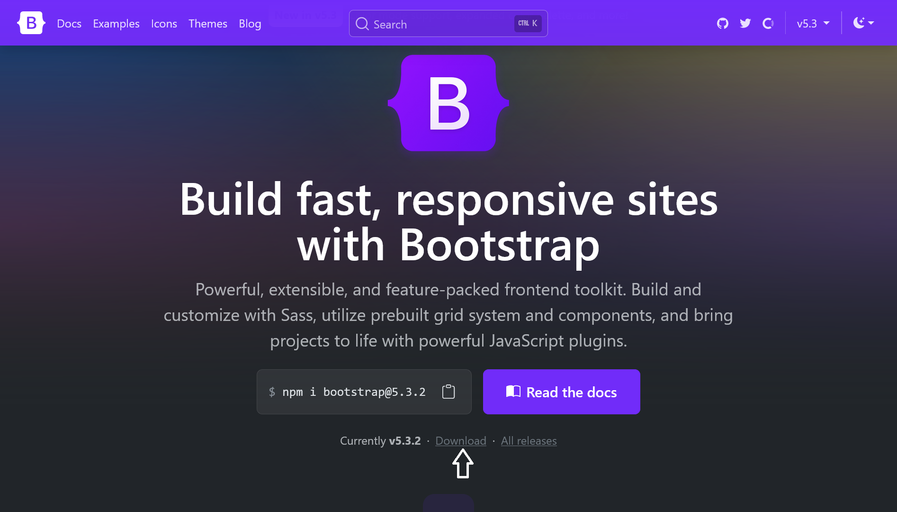
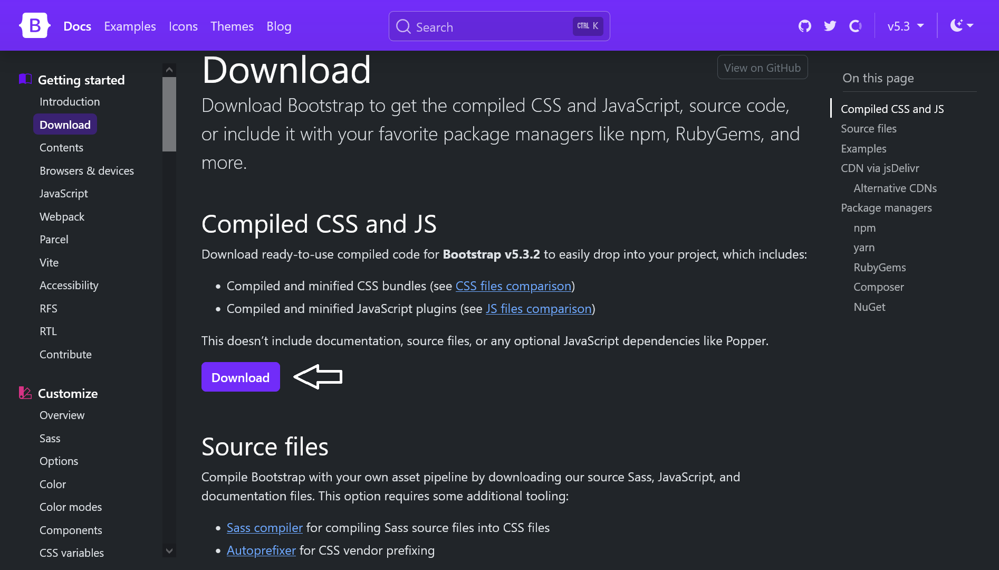

# The_Bootstrap_framework
 
 Introduction to the use of Bootstrap

## Contents
 1. What is Bootstrap?
 2. Download and integrate Bootstrap
 3. Create layouts with Bootstrap
 
 
 
-------------------------------------------------------

# 1. What is Bootstrap?

Bootstrap is a ready-made CSS framework. Basically, it is a kind of construction kit with ready-made and dynamic design elements. Such a framework usually contains a collection of tools such as a grid layout, e.g. for responsive web design. Web typography is also an important part of such a framework. Very good and comprehensive documentation can also be found on the official website [Bootstrap](https://getbootstrap.com/).


# 2. Download and integrate Bootstrap
The first step is to download Bootstrap, which you can do here: [Bootstrap](https://getbootstrap.com/). To get started, the finished version is sufficient, which is already ready for use with CSS, JavaScript and fonts.

 

 

After downloading, the zip folder can be unpacked. The Bootstrap folder contains the "css" and "js" folders, each of which contains all the CSS files and JavaScript plug-ins required to use Bootstrap with an HTML document.

 [Complete Code](https://github.com/BellaMrx/The_Bootstrap_framework/tree/main/Examples/Part_1) --> **Examples/Part_1/...** 

   ```
    <head>
        <title>Integrate Bootstrap</title>
        <meta charset="utf-8">
        <meta name="viewport" content="width=device-width, initial-scale=1, shrink-to-fit=no">
        <!-- integrate bootstrap css -->
        <link href="css/bootstrap.min.css" rel="stylesheet" type="text/css"> 
    </head>
    <body>
        <div class="container">
            <h1>h1. heading</h1>
            <blockquote>
                <p>Lorem ipsum dolor sit amet, consectetur adipiscing elit. Integer posuere erat a ante. Lorem ipsum dolor sit amet, consectetur adipiscing elit. Integer posuere erat a ante.Lorem ipsum dolor sit amet, consectetur adipiscing elit. Integer posuere
                erat a ante.Lorem ipsum dolor sit amet, consectetur adipiscing elit. Integer posuere erat a ante.Lorem ipsum dolor sit amet, consectetur adipiscing elit. Integer posuere erat a ante.</p>
            </blockquote>
        </div>
        <!-- integrate bootstrap js -->
        <script src="js/bootstrap.min.js" type="text/javascript"></script> 
   ```

The CSS file is inserted in the *head* area and the JavaScript file at the end of the HTML document. 

Alternatively, you can also use a CDN (Content Delivery Network). This eliminates the need to download the files. The CDN part for Bootstrap via jsDelivr looks like this:

   ```
    <!-- integrate bootstrap css -->
    <link href="https://cdn.jsdelivr.net/npm/bootstrap@5.3.2/dist/css/bootstrap.min.css" rel="stylesheet" integrity="sha384-T3c6CoIi6uLrA9TneNEoa7RxnatzjcDSCmG1MXxSR1GAsXEV/Dwwykc2MPK8M2HN" crossorigin="anonymous">

    <!-- integrate bootstrap js -->
    <script src="https://cdn.jsdelivr.net/npm/bootstrap@5.3.2/dist/js/bootstrap.bundle.min.js" integrity="sha384-C6RzsynM9kWDrMNeT87bh95OGNyZPhcTNXj1NW7RuBCsyN/o0jlpcV8Qyq46cDfL" crossorigin="anonymous"></script>
   ```

For the JavaScript functionalities of Bootstrap, the framework offers a bundle that includes Bootstrap and Popper. Popper is a JavaScript library that helps to create pop-overs etc. in web applications:

   ```
    <script src="https://cdn.jsdelivr.net/npm/@popperjs/core@2.11.8/dist/umd/popper.min.js" integrity="sha384-I7E8VVD/ismYTF4hNIPjVp/Zjvgyol6VFvRkX/vR+Vc4jQkC+hVqc2pM8ODewa9r" crossorigin="anonymous"></script>

    <script src="https://cdn.jsdelivr.net/npm/bootstrap@5.3.2/dist/js/bootstrap.min.js" integrity="sha384-BBtl+eGJRgqQAUMxJ7pMwbEyER4l1g+O15P+16Ep7Q9Q+zqX6gSbd85u4mG4QzX+" crossorigin="anonymous"></script>
   ```
Example:

 [Complete Code](https://github.com/BellaMrx/The_Bootstrap_framework/tree/main/Examples/Part_2) --> **Examples/Part_2/...** 

   ```
    <head>
        <title>Integrate Bootstrap</title>
        <meta charset="utf-8">
        <meta name="viewport" content="width=device-width, initial-scale=1, shrink-to-fit=no">
        <link href="https://cdn.jsdelivr.net/npm/bootstrap@5.3.2/dist/css/bootstrap.min.css" rel="stylesheet" 
        integrity="sha384-T3c6CoIi6uLrA9TneNEoa7RxnatzjcDSCmG1MXxSR1GAsXEV/Dwwykc2MPK8M2HN" crossorigin="anonymous"> 
    </head>
    <body>
        <div class="container">
            <h1>h1. heading</h1>
            <blockquote>
                <p>Lorem ipsum dolor sit amet, consectetur adipiscing elit. Integer posuere erat a ante. Lorem ipsum dolor sit amet, consectetur adipiscing elit. Integer posuere erat a ante.Lorem ipsum dolor sit amet, consectetur adipiscing elit. Integer posuere
                erat a ante.Lorem ipsum dolor sit amet, consectetur adipiscing elit. Integer posuere erat a ante.Lorem ipsum dolor sit amet, consectetur adipiscing elit. Integer posuere erat a ante.</p>
            </blockquote>
        </div>
        <script src="https://cdn.jsdelivr.net/npm/bootstrap@5.3.2/dist/js/bootstrap.bundle.min.js" 
        integrity="sha384-C6RzsynM9kWDrMNeT87bh95OGNyZPhcTNXj1NW7RuBCsyN/o0jlpcV8Qyq46cDfL" crossorigin="anonymous"></script>
    </body>
   ```

Once the files have been integrated, the framework can be used. The Bootstrap documentation can be used to find out which classes can be assigned to the elements. In the example above, for example, the entire content was packed in a `<div>` block with the bootstrap class `container`, which centers the entire content of the HTML document.


## 3. Create layouts with Bootstrap

 