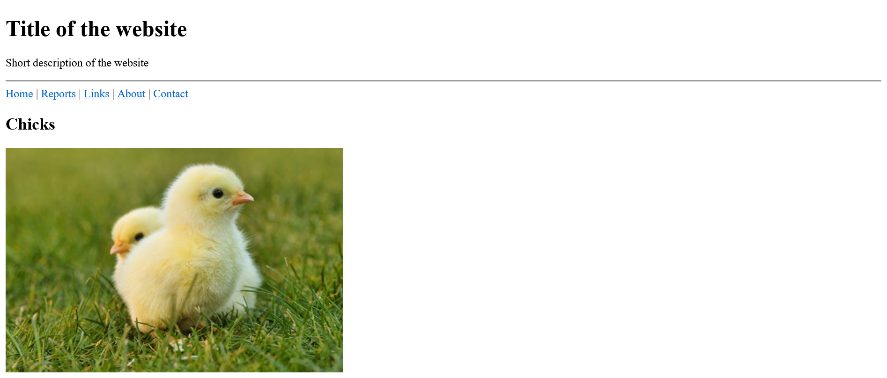
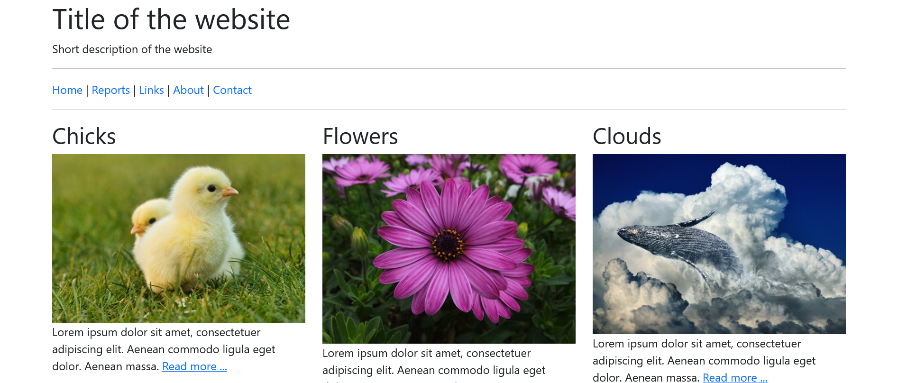
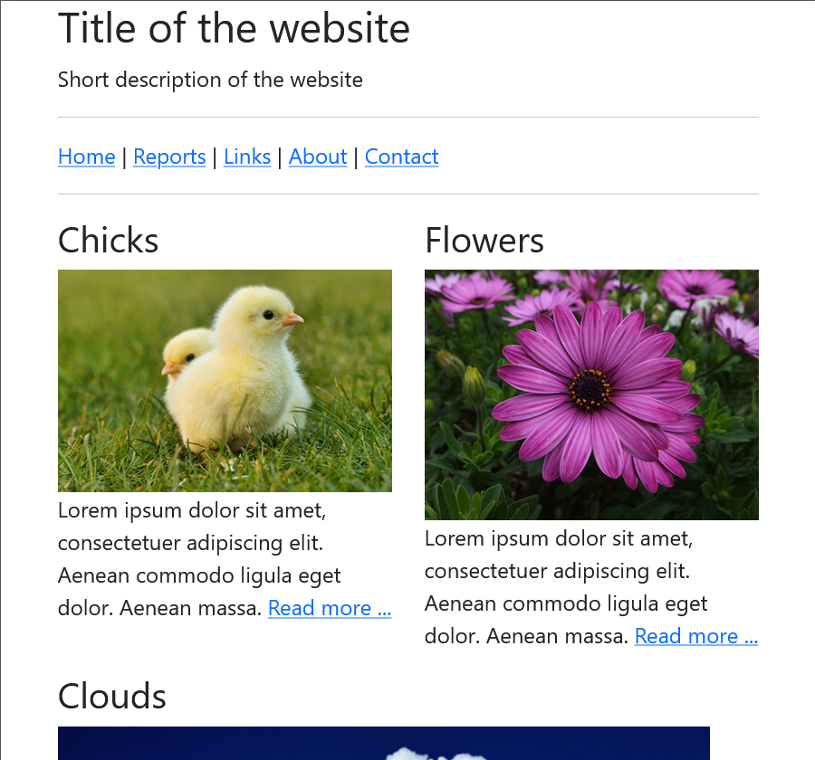
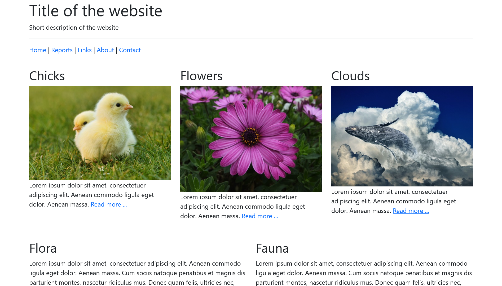
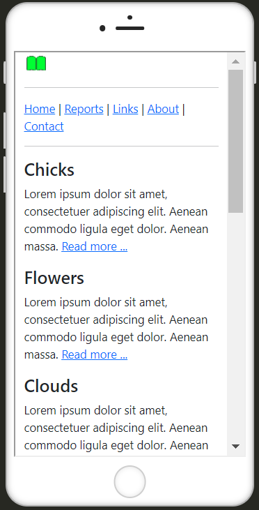

# The_Bootstrap_framework
 
 Introduction to the use of Bootstrap

### Contents
 1. What is Bootstrap?
 2. Download and integrate Bootstrap
 3. Create layouts with Bootstrap
 4. Use components
 
 
 
-------------------------------------------------------

## 1. What is Bootstrap?

Bootstrap is a ready-made CSS framework. Basically, it is a kind of construction kit with ready-made and dynamic design elements. Such a framework usually contains a collection of tools such as a grid layout, e.g. for responsive web design. Web typography is also an important part of such a framework. Very good and comprehensive documentation can also be found on the official website [Bootstrap](https://getbootstrap.com/).


## 2. Download and integrate Bootstrap

The first step is to download Bootstrap, which you can do here: [Bootstrap](https://getbootstrap.com/). To get started, the finished version is sufficient, which is already ready for use with CSS, JavaScript and fonts.

 

 

After downloading, the zip folder can be unpacked. The Bootstrap folder contains the "css" and "js" folders, each of which contains all the CSS files and JavaScript plug-ins required to use Bootstrap with an HTML document.

 [Complete Code](https://github.com/BellaMrx/The_Bootstrap_framework/tree/main/Examples/Part_1) --> **Examples/Part_1/...** 

   ```
    <head>
        <title>Integrate Bootstrap</title>
        <meta charset="utf-8">
        <meta name="viewport" content="width=device-width, initial-scale=1, shrink-to-fit=no">
        <!-- integrate bootstrap css -->
        <link href="css/bootstrap.min.css" rel="stylesheet" type="text/css"> 
    </head>
    <body>
        <div class="container">
            <h1>h1. heading</h1>
            <blockquote>
                <p>Lorem ipsum dolor sit amet, consectetur adipiscing elit. Integer posuere erat a ante. Lorem ipsum dolor sit amet, consectetur adipiscing elit. Integer posuere erat a ante.Lorem ipsum dolor sit amet, consectetur adipiscing elit. Integer posuere
                erat a ante.Lorem ipsum dolor sit amet, consectetur adipiscing elit. Integer posuere erat a ante.Lorem ipsum dolor sit amet, consectetur adipiscing elit. Integer posuere erat a ante.</p>
            </blockquote>
        </div>
        <!-- integrate bootstrap js -->
        <script src="js/bootstrap.min.js" type="text/javascript"></script> 
   ```

The CSS file is inserted in the *head* area and the JavaScript file at the end of the HTML document. 

Alternatively, you can also use a CDN (Content Delivery Network). This eliminates the need to download the files. The CDN part for Bootstrap via jsDelivr looks like this:

   ```
    <!-- integrate bootstrap css -->
    <link href="https://cdn.jsdelivr.net/npm/bootstrap@5.3.2/dist/css/bootstrap.min.css" rel="stylesheet" integrity="sha384-T3c6CoIi6uLrA9TneNEoa7RxnatzjcDSCmG1MXxSR1GAsXEV/Dwwykc2MPK8M2HN" crossorigin="anonymous">

    <!-- integrate bootstrap js -->
    <script src="https://cdn.jsdelivr.net/npm/bootstrap@5.3.2/dist/js/bootstrap.bundle.min.js" integrity="sha384-C6RzsynM9kWDrMNeT87bh95OGNyZPhcTNXj1NW7RuBCsyN/o0jlpcV8Qyq46cDfL" crossorigin="anonymous"></script>
   ```

For the JavaScript functionalities of Bootstrap, the framework offers a bundle that includes Bootstrap and Popper. Popper is a JavaScript library that helps to create pop-overs etc. in web applications:

   ```
    <script src="https://cdn.jsdelivr.net/npm/@popperjs/core@2.11.8/dist/umd/popper.min.js" integrity="sha384-I7E8VVD/ismYTF4hNIPjVp/Zjvgyol6VFvRkX/vR+Vc4jQkC+hVqc2pM8ODewa9r" crossorigin="anonymous"></script>

    <script src="https://cdn.jsdelivr.net/npm/bootstrap@5.3.2/dist/js/bootstrap.min.js" integrity="sha384-BBtl+eGJRgqQAUMxJ7pMwbEyER4l1g+O15P+16Ep7Q9Q+zqX6gSbd85u4mG4QzX+" crossorigin="anonymous"></script>
   ```
Example:

 [Complete Code](https://github.com/BellaMrx/The_Bootstrap_framework/tree/main/Examples/Part_2) --> **Examples/Part_2/...** 

   ```
    <head>
        <title>Integrate Bootstrap</title>
        <meta charset="utf-8">
        <meta name="viewport" content="width=device-width, initial-scale=1, shrink-to-fit=no">
        <link href="https://cdn.jsdelivr.net/npm/bootstrap@5.3.2/dist/css/bootstrap.min.css" rel="stylesheet" 
        integrity="sha384-T3c6CoIi6uLrA9TneNEoa7RxnatzjcDSCmG1MXxSR1GAsXEV/Dwwykc2MPK8M2HN" crossorigin="anonymous"> 
    </head>
    <body>
        <div class="container">
            <h1>h1. heading</h1>
            <blockquote>
                <p>Lorem ipsum dolor sit amet, consectetur adipiscing elit. Integer posuere erat a ante. Lorem ipsum dolor sit amet, consectetur adipiscing elit. Integer posuere erat a ante.Lorem ipsum dolor sit amet, consectetur adipiscing elit. Integer posuere
                erat a ante.Lorem ipsum dolor sit amet, consectetur adipiscing elit. Integer posuere erat a ante.Lorem ipsum dolor sit amet, consectetur adipiscing elit. Integer posuere erat a ante.</p>
            </blockquote>
        </div>
        <script src="https://cdn.jsdelivr.net/npm/bootstrap@5.3.2/dist/js/bootstrap.bundle.min.js" 
        integrity="sha384-C6RzsynM9kWDrMNeT87bh95OGNyZPhcTNXj1NW7RuBCsyN/o0jlpcV8Qyq46cDfL" crossorigin="anonymous"></script>
    </body>
   ```

Once the files have been integrated, the framework can be used. The Bootstrap documentation can be used to find out which classes can be assigned to the elements. In the example above, for example, the entire content was packed in a `<div>` block with the bootstrap class `container`, which centers the entire content of the HTML document.


## 3. Create layouts with Bootstrap
The first step was to create an HTML framework for the web project. This is then further designed and improved with Bootstrap.

HTML basic structure without bootstrap:

 [Complete Code](https://github.com/BellaMrx/The_Bootstrap_framework/tree/main/Examples/Part_3) --> **Examples/Part_3/...** 

   ```
   <body>
    <header>
        <h1>Title of the website</h1>
        <p>Short description of the website</p>
        <hr>
    </header>
    <nav>
        <a href="#">Home</a> |
        <a href="#">Reports</a> |
        <a href="#">Links</a> |
        <a href="#">About</a> |
        <a href="#">Contact</a>
    </nav>
    <article>
        <h2>Chicks </h2>
        
        <p>Lorem ipsum dolor sit amet, consectetuer adipiscing elit. Aenean commodo ligula eget dolor. Aenean massa. <a href="#">Read more ...</a></p>
    </article>
    <article>
        <h2>Flowers </h2>
        
        <p>Lorem ipsum dolor sit amet, consectetuer adipiscing elit. Aenean commodo ligula eget dolor. Aenean massa. <a href="#">Read more ...</a></p>
    </article>
    <article>
        <h2>Clouds </h2>
        
        <p>Lorem ipsum dolor sit amet, consectetuer adipiscing elit. Aenean commodo ligula eget dolor. Aenean massa. <a href="#">Read more ...</a></p>
    </article>
    <article>
        <h2>Flora</h2>
        <p>Lorem ipsum dolor sit amet, consectetuer adipiscing elit. Aenean commodo ligula eget dolor. Aenean massa. Cum sociis natoque penatibus et magnis dis parturient montes, nascetur ridiculus mus. Donec quam felis, ultricies nec, pellentesque eu, pretium
            quis, sem. Nulla consequat massa quis enim. Donec pede justo, fringilla vel, aliquet nec, vulputate eget, arcu. In enim justo, rhoncus ut. Aenean massa. <br><a href="#">Read more ...</a></p>
    </article>
    <article>
        <h2>Fauna</h2>
        <p>Lorem ipsum dolor sit amet, consectetuer adipiscing elit. Aenean commodo ligula eget dolor. Aenean massa. Cum sociis natoque penatibus et magnis dis parturient montes, nascetur ridiculus mus. Donec quam felis, ultricies nec, pellentesque eu, pretium
            quis, sem. Nulla consequat massa quis enim. Donec pede justo, fringilla vel, aliquet nec, vulputate eget, arcu. In enim justo, rhoncus ut. Aenean massa. <br><a href="#">Read more ...</a></p>
    </article>
    <footer>
        <p>&copy; Name | <a href="#">Legal notice</a></p>
    </footer>
   </body>
   ```

 
 
The same website with the use of Bootstrap:

 [Complete Code](https://github.com/BellaMrx/The_Bootstrap_framework/tree/main/Examples/Part_4) --> **Examples/Part_4/...** 

   ```
   <head>
    <title>Bootstrap-Layout</title>
    <meta charset="utf-8">
    <meta name="viewport" content="width=device-width, initial-scale=1">
    <link href="https://cdn.jsdelivr.net/npm/bootstrap@5.3.2/dist/css/bootstrap.min.css" rel="stylesheet" 
    integrity="sha384-T3c6CoIi6uLrA9TneNEoa7RxnatzjcDSCmG1MXxSR1GAsXEV/Dwwykc2MPK8M2HN" crossorigin="anonymous">
   </head>
   <body>
    <div class="container">
        <div class="row">
            <header class="col-md-12">
                <h1>Title of the website</h1>
                <p>Short description of the website</p>
                <hr>
            </header>
        </div>
        <div class="row">
            <nav class="col-md-12">
                <a href="#">Home</a> |
                <a href="#">Reports</a> |
                <a href="#">Links</a> |
                <a href="#">About</a> |
                <a href="#">Contact</a>
            </nav>
        </div>
        <hr>
        <div class="row">
            <article class="col-md-4">
                <h2>Chicks </h2>
                
                <p>Lorem ipsum dolor sit amet, consectetuer adipiscing elit. Aenean commodo ligula eget dolor. Aenean massa. <a href="#">Read more ...</a></p>
            </article>
            <article class="col-md-4">
                <h2>Flowers </h2>
                
                <p>Lorem ipsum dolor sit amet, consectetuer adipiscing elit. Aenean commodo ligula eget dolor. Aenean massa. <a href="#">Read more ...</a></p>
            </article>
            <article class="col-md-4">
                <h2>Clouds </h2>
                
                <p>Lorem ipsum dolor sit amet, consectetuer adipiscing elit. Aenean commodo ligula eget dolor. Aenean massa. <a href="#">Read more ...</a></p>
            </article>
        </div>
        <hr>
        <div class="row">
            <article class="col-md-6">
                <h2>Flora</h2>
                <p>Lorem ipsum dolor sit amet, consectetuer adipiscing elit. Aenean commodo ligula eget dolor. Aenean massa. Cum sociis natoque penatibus et magnis dis parturient montes, nascetur ridiculus mus. Donec quam felis, ultricies nec, pellentesque
                    eu, pretium quis, sem. Nulla consequat massa quis enim. Donec pede justo, fringilla vel, aliquet nec, vulputate eget, arcu. In enim justo, rhoncus ut. Aenean massa. <br><a href="#">Read more ...</a></p>
            </article>
            <article class="col-md-6">
                <h2>Fauna</h2>
                <p>Lorem ipsum dolor sit amet, consectetuer adipiscing elit. Aenean commodo ligula eget dolor. Aenean massa. Cum sociis natoque penatibus et magnis dis parturient montes, nascetur ridiculus mus. Donec quam felis, ultricies nec, pellentesque
                    eu, pretium quis, sem. Nulla consequat massa quis enim. Donec pede justo, fringilla vel, aliquet nec, vulputate eget, arcu. In enim justo, rhoncus ut. Aenean massa. <br><a href="#">Read more ...</a></p>
            </article>
        </div>
        <hr>
        <div class="row">
            <footer class="col-md-12 text-center">
                <p>&copy; Name | <a href="#">Legal notice</a></p>
            </footer>
        </div>
    </div>
    <script src="https://cdn.jsdelivr.net/npm/bootstrap@5.3.2/dist/js/bootstrap.bundle.min.js" 
    integrity="sha384-C6RzsynM9kWDrMNeT87bh95OGNyZPhcTNXj1NW7RuBCsyN/o0jlpcV8Qyq46cDfL" crossorigin="anonymous"></script>
   </body>
   ```

 

Here, the entire content is placed in the `.container` class. The layout was created line by line in this class. The `header` element was placed in the first line and the `nav` element in the next line. Both elements extend over all 12 columns of the class `.row` because of the class `.col-md-12`. In the third row, three elements with the class `.col-md-4` have been placed, each on three columns in the row. The fourth row contains two `article` elements with `.col-md-6` on two columns each. The last line contains the footer which behaves in the same way as the header. The class `.img-fluid` in `` ensures that Bootstrap automatically adjusts an image to the parent element.

With bootstraps, for example, the images are displayed side by side instead of one below the other if the screen size is wide enough. In the mobile view, the images are automatically displayed one below the other. This is an advantage of Bootstrap, as you don't have to write any media queries yourself. The viewport meta tag was added here so that zooming is possible on mobile devices.

A quick overview of how the layout is realized with Bootstrap:

1. First, it is determined whether the complete layout is to be defined in a fixed width with the class `.container` or in full width with the class `.container-fluid`. `.container` means that the value of `max-width` is reset at each breakpoint. With `.container-fluid`, on the other hand, `width: 100%;` applies to all breakpoints. If the content of the web page is packed in `.container`, it is displayed centered.

 - the complete content of a website is packaged in this way:

   ```
    <div class="container">
        ...
    </div>
   ```

2. Within the containers, the rows should be defined with the class `.row` to create horizontal groups with columns.

   ```
    <div class="container">
        <div class="row">...</div>
        <div class="row">...</div>
        ...
    </div>
   ```

3. The actual content is placed in the columns of the `.row` class. Bootstrap offers many different classes for this purpose. The grid is specified via class names, e.g. `.col-md-x`, the `x` stands for the number of 12 available columns. The `md` stands for medium-sized devices such as desktop PCs with a screen size of 768 pixels or more. If the class `.col-md-8` is used for an element, this element occupies 8 columns of the 12 available columns in a cell. If two elements with the class `.col-md-6` are packed into a row of the class `.row`, the two elements are created in two columns of the same size. The grid system of Bootstrap was realized with Flexbox.

   ```
    <div class="container">
        <div class="row">
            <header class="col-md-12">...</header>
        </div>
        <div class="row">
            <article class="col-md-4">...</article>   
            <article class="col-md-4">...</article>
            <article class="col-md-4">...</article>    
        </div>
        <div class="row">
            <article class="col-md-8">...</article> 
            <article class="col-md-4">...</article> 
        </div>
        ...
    </div>
   ```

Bootstrap offers even more raster classes besides `.col-md-x`. There are also the classes `.col-xs-x`, `.col-sm-x` and `.col-lg-x`, which work accordingly on the different devices.

| Class Prefix | Device       |
| ------------ | ------------ |
| `.col-`      | extra-small devices such as smartphones with a screen smaller than 576 px |
| `.col-sm-`   | small devices such as smartphones or tablets with a screen size greater than or equal to 576 px |
| `.col-md-`   | medium-sized devices such as tablets or desktop PCs with a screen size greater than or equal to 768px |
| `.col-lg-`   | large devices such as tablets or desktop PCs with a screen size greater than or equal to 960 px |
| `.col-xl-`   | large devices such as desktop PC with a screen larger than or equal to 1200 px |
| `.col-xxl-`  | extra-large devices such as desktop PCs with a screen larger than or equal to 1400 px |

The class `.col-md-x` is used to create a basic column grid whose columns are arranged one above the other on smartphones and narrow tablets and next to each other from medium screen sizes.

If the elements are not simply to be arranged on top of each other on the tablet, the arrangement can be changed with the device grid class `.col-sm-x`:

 [Complete Code](https://github.com/BellaMrx/The_Bootstrap_framework/tree/main/Examples/Part_5) --> **Examples/Part_5/...** 

   ```
    <div class="container">
        <div class="row">
            <header class="col-md-12">
                <h1>Title of the website</h1>
                <p>Short description of the website</p>
                <hr>
            </header>
        </div>
        <div class="row">
            <nav class="col-md-12">
                <a href="#">Home</a> |
                <a href="#">Reports</a> |
                <a href="#">Links</a> |
                <a href="#">About</a> |
                <a href="#">Contact</a>
            </nav>
        </div>
        <hr>
        <div class="row">
            <article class="col-sm-6 col-md-4">
                <h2>Chicks </h2>
                
                <p>Lorem ipsum dolor sit amet, consectetuer adipiscing elit. Aenean commodo ligula eget dolor. Aenean massa. <a href="#">Read more ...</a></p>
            </article>
            <article class="col-sm-6 col-md-4">
                <h2>Flowers </h2>
                
                <p>Lorem ipsum dolor sit amet, consectetuer adipiscing elit. Aenean commodo ligula eget dolor. Aenean massa. <a href="#">Read more ...</a></p>
            </article>
            <article class="col-sm-12 col-md-4">
                <h2>Clouds </h2>
                
                <p>Lorem ipsum dolor sit amet, consectetuer adipiscing elit. Aenean commodo ligula eget dolor. Aenean massa. <a href="#">Read more ...</a></p>
            </article>
        </div>
        <hr>
        <div class="row">
            <article class="col-md-6">
                <h2>Flora</h2>
                <p>Lorem ipsum dolor sit amet, consectetuer adipiscing elit. Aenean commodo ligula eget dolor. Aenean massa. Cum sociis natoque penatibus et magnis dis parturient montes, nascetur ridiculus mus. Donec quam felis, ultricies nec, pellentesque
                    eu, pretium quis, sem. Nulla consequat massa quis enim. Donec pede justo, fringilla vel, aliquet nec, vulputate eget, arcu. In enim justo, rhoncus ut. Aenean massa. <br><a href="#">Read more ...</a></p>
            </article>
            <article class="col-md-6">
                <h2>Fauna</h2>
                <p>Lorem ipsum dolor sit amet, consectetuer adipiscing elit. Aenean commodo ligula eget dolor. Aenean massa. Cum sociis natoque penatibus et magnis dis parturient montes, nascetur ridiculus mus. Donec quam felis, ultricies nec, pellentesque
                    eu, pretium quis, sem. Nulla consequat massa quis enim. Donec pede justo, fringilla vel, aliquet nec, vulputate eget, arcu. In enim justo, rhoncus ut. Aenean massa. <br><a href="#">Read more ...</a></p>
            </article>
        </div>
        <hr>
        <div class="row">
            <footer class="col-md-12 text-center">
                <p>&copy; Name | <a href="#">Legal notice</a></p>
            </footer>
        </div>
    </div>
   ```

 

The display of the website is automatically adjusted again on larger screens.


### Show and hide elements with the help of Bootstrap

Bootstrap provides ready-made (helper) classes for different display window sizes for showing and hiding elements. For example, to show and hide individual graphics for a smartphone version, the class `.d-none-{value}` or `.d-{value}-block` (d = display) can be used. For `value`, `sm`, `md`, `lg` and `lx` must be used according to the screen size.

 [Complete Code](https://github.com/BellaMrx/The_Bootstrap_framework/tree/main/Examples/Part_6) --> **Examples/Part_6/...** 

   ```
    ...
    <div class="container">
        <div class="row">
            <header class="col-md-12">
                <h1 class="d-none d-sm-block">Title of the website</h1>
                <p class="d-none d-sm-block">Short description of the website</p>
                
                <hr>
            </header>
        </div>
        <div class="row">
            <nav class="col-md-12">
                <a href="#">Home</a> |
                <a href="#">Reports</a> |
                <a href="#">Links</a> |
                <a href="#">About</a> |
                <a href="#">Contact</a>
            </nav>
        </div>
        <hr>
        <div class="row">
            <article class="col-sm-6 col-md-4">
                <h2>Chicks </h2>
                
                <p>Lorem ipsum dolor sit amet, consectetuer adipiscing elit. Aenean commodo ligula eget dolor. Aenean massa. <a href="#">Read more ...</a></p>
            </article>
            <article class="col-sm-6 col-md-4">
                <h2>Flowers </h2>
                
                <p>Lorem ipsum dolor sit amet, consectetuer adipiscing elit. Aenean commodo ligula eget dolor. Aenean massa. <a href="#">Read more ...</a></p>
            </article>
            <article class="col-sm-12 col-md-4">
                <h2>Clouds </h2>
                
                <p>Lorem ipsum dolor sit amet, consectetuer adipiscing elit. Aenean commodo ligula eget dolor. Aenean massa. <a href="#">Read more ...</a></p>
            </article>
        </div>
     ...
    </div>
   ```

 

 


## 4. Use components
Bootstrap offers a large number of ready-made components such as icons, menus, warnings, cards, labels and navigations.
